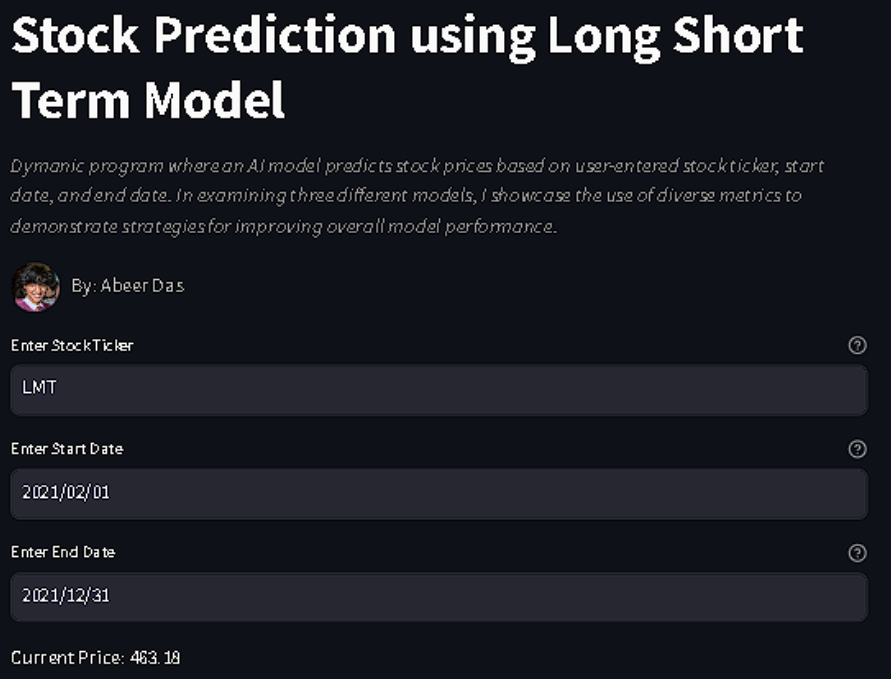
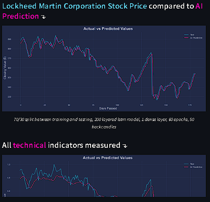

# Stock Market Prediction 📈
## Viewing Code and Files
If you simply want to view the program and reading, head over to ```stockmarketprediction-akd.streamlit.app``` 

The main code however is on streamlit_app.py. The code used to train the AI is in jupyter notebook files under
TrainingCode. For reference, the files Ntech, v1, and v2 are displayed on the streamlit in that same order. I 
recommend downloading the jupyter files as they can be viewed better that way. 

<p align="center">
  
</p>
<p align="center">
  
</p>

